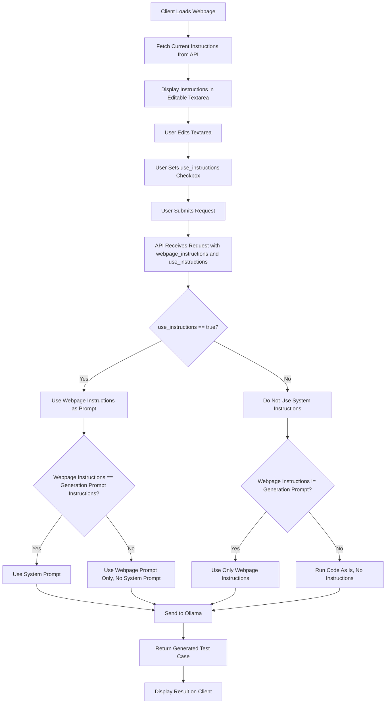

# Instructions Editing Plan

## Current State Record

Based on research of the deployment folder:

### Two Implementations

1. **nginx-wsl-deployment** (Production/Secure):
   - Architecture: Windows port 8009 → WSL NGINX (0.0.0.0:8080) → Flask (127.0.0.1:5009)
   - Security: Flask isolated to localhost, NGINX reverse proxy with security headers, request filtering
   - Use Case: Production, multi-user, network-accessible, security-critical
   - Files: app.py, client HTML/JS in public_gui/, admin in admin_gui/

2. **regular-wsl-deployment** (Development/Simple):
   - Architecture: Windows port 8009 → WSL Flask (0.0.0.0:5009)
   - Security: Flask directly exposed, basic firewall rules
   - Use Case: Development, testing, single-user, quick setup
   - Files: app.py, client HTML/JS in public_gui/, admin in admin_gui/

Both share identical client interfaces and admin dashboards, but differ in API prompt logic.

### Instructions Handling

- **File Location**: instructions/system_instructions.md (same content in both deployments)
- **Loading Mechanism**: get_instructions() function reads the file at startup/API calls, fallback to default if missing. USE_SYSTEM_INSTRUCTIONS env var (default) controls global usage.
- **Key Functions**:
  - get_instructions(): Returns instructions content if use_instructions is True (or global default), else empty string
  - build_user_prompt(): Builds the user prompt with requirement details
    - nginx-wsl-deployment: Always includes full product context (SolaHD UPS details) and structured guidelines
    - regular-wsl-deployment: Conditionally includes product context and guidelines based on use_instructions flag
- **Options for Using Configured Prompts**:
  - Global: USE_SYSTEM_INSTRUCTIONS env var (affects system prompt)
  - Per-Request: use_instructions boolean parameter in API calls (affects both system and generation prompts)
  - Client UI: Checkbox "Use System Instructions (recommended)" in both public and admin interfaces
  - Admin Override: Instructions tab allows editing instructions.md via POST
- **Client Interaction**:
  - Public Client (/client): Checkbox controls use_instructions flag sent to API, default checked
  - Admin Interface (/admin - development mode only): Instructions tab displays current content from GET, editable textarea with save/reload buttons, changes take effect immediately via POST
- **Data Flows**:
  1. Request Initiation: Client sends JSON with requirement fields + optional use_instructions flag; Admin can edit instructions file via dedicated endpoint
  2. Prompt Building: get_instructions() loads instructions.md if use_instructions true; build_user_prompt() adds requirement details + product context/guidelines (conditional in regular, always in nginx)
  3. Ollama Call: Payload includes 'system' field (instructions) if not empty; 'prompt' field contains generation prompt with requirement + context
  4. Response: Generated test case returned in 'response' field; Instructions file metadata available via GET
- **Existing Mechanisms for Editing/Overriding Instructions**:
  - File-Level Editing: Admin interface allows direct editing of instructions.md
  - Per-Request Override: use_instructions parameter bypasses global setting
  - Environment Override: USE_SYSTEM_INSTRUCTIONS env var for deployment-wide control
  - API Endpoints: GET /instructions: Retrieve current instructions + file path; POST /instructions: Update instructions file (requires "instructions" field in JSON)
- **Key Differences Between Implementations**:
  - Prompt Logic: nginx always uses full structured prompts; regular allows minimal prompts when use_instructions false
  - Security: nginx isolates Flask behind NGINX; regular exposes Flask directly
  - Production Readiness: nginx includes security headers, request buffering; regular is basic Flask

## Process Flow Diagram

This diagram illustrates the decision flow for handling instructions based on the revised logic.
