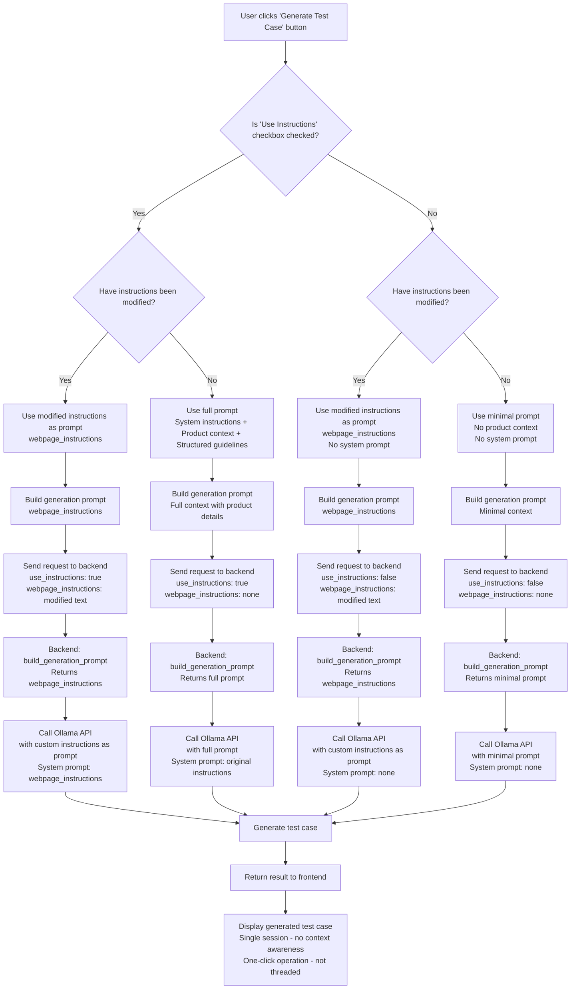

# Test Case Generation Process Flow

## Decision Table Matrix

### Grouped by Checkbox State

#### When "Use Instructions" is **Checked** (use_instructions = true)
| Instructions Modified | System Prompt | Generation Prompt | Description |
|----------------------|---------------|-------------------|-------------|
| Yes | Modified instructions (webpage_instructions) | Modified instructions (webpage_instructions) | Uses custom instructions for both system and generation prompts |
| No | Original system instructions | Full prompt with product context | Uses default system instructions + detailed generation prompt |

#### When "Use Instructions" is **Unchecked** (use_instructions = false)
| Instructions Modified | System Prompt | Generation Prompt | Description |
|----------------------|---------------|-------------------|-------------|
| Yes | None (empty string) | Modified instructions (webpage_instructions) | Uses custom instructions for generation prompt only, no system context |
| No | None (empty string) | Minimal prompt without context | Basic generation prompt without system instructions or product context |

## Process Explanation

This flowchart illustrates the complete process flow from the user's button click to displaying the generated test case result. The key decision points are:

1. **Checkbox State**: Whether "Use Instructions" is checked determines if system/product context is included
2. **Modification Check**: Whether the instructions textarea has been modified from the original system instructions
3. **Prompt Selection**: Based on the combination, one of four prompt types is used:
   - **Checked + Modified**: Custom instructions from webpage (both generation and system prompt)
   - **Checked + Unmodified**: Full system prompt with product context (generation and system)
   - **Unchecked + Modified**: Custom instructions from webpage (generation prompt only, no system prompt)
   - **Unchecked + Unmodified**: Minimal prompt without context (no system prompt)

The process is stateless (single session), one-click (immediate generation), and non-threaded (synchronous operation). The backend correctly handles all four conditions as implemented in the updated code.

The code changes ensure that:
- Client-side tracks original instructions and sends `webpage_instructions` when modified
- Backend's `build_generation_prompt` function selects the appropriate generation prompt based on both `use_instructions` flag and presence of `webpage_instructions`
- `build_system_prompt` provides system context only when `use_instructions` is True
- System prompt and generation prompt are handled separately for proper Ollama API usage

This implementation fully complies with the four conditional behaviors.